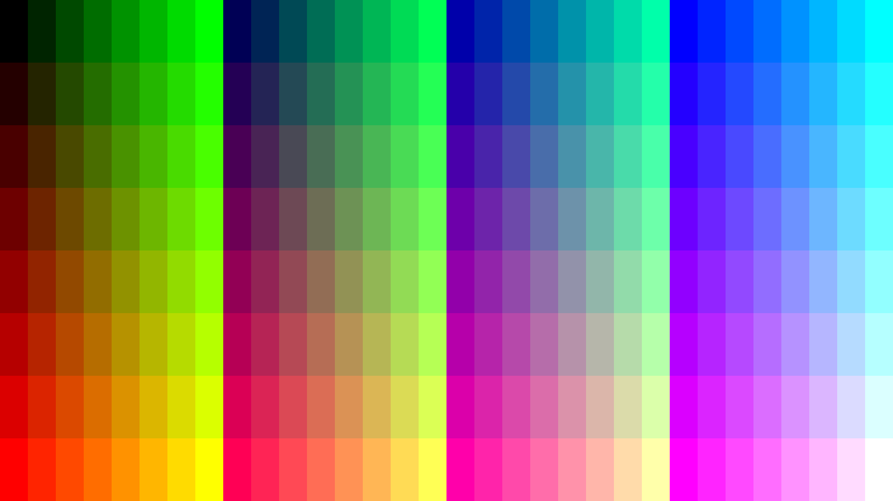

# RGB332 Chart via `node.js` and `pngjs`

Programmatically create a color chart for all 256 8-bit RGB332 colors using
[pngjs package](https://www.npmjs.com/package/pngjs)

But this was really a practice exercise for
[Visual Studio Code dev container support](https://docs.microsoft.com/en-us/learn/modules/use-docker-container-dev-env-vs-code/)
thus most of the files here are VS Code files to spin up a Node.js Docker container
just to run `rgb332_chart.js`. It's all quite overkill for such a little program.

Output file:

